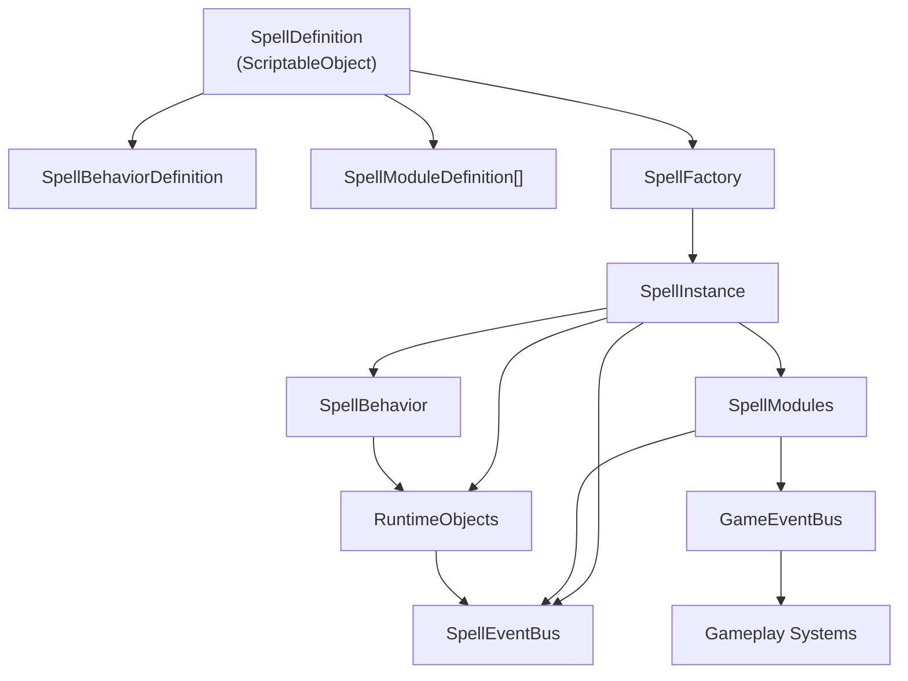

```mermaid
flowchart TD

    SD["SpellDefinition<br/>(ScriptableObject)"]

    SB["SpellBehaviorDefinition"]
    SM["SpellModuleDefinition[]"]

    SF["SpellFactory"]

    SI["SpellInstance"]

    B["SpellBehavior"]
    M["SpellModules"]

    RO["RuntimeObjects"]

    SE["SpellEventBus"]
    GE["GameEventBus"]

    GS["Gameplay Systems"]

    SD --> SB
    SD --> SM

    SD --> SF

    SF --> SI

    SI --> B
    SI --> M
    SI --> RO
    SI --> SE

    M --> SE
    B --> RO
    RO --> SE

    M --> GE

    GE --> GS
```